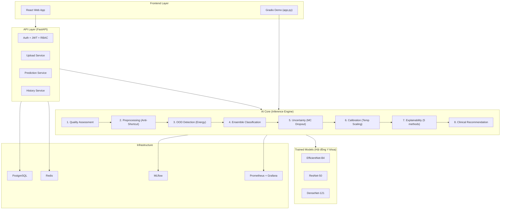
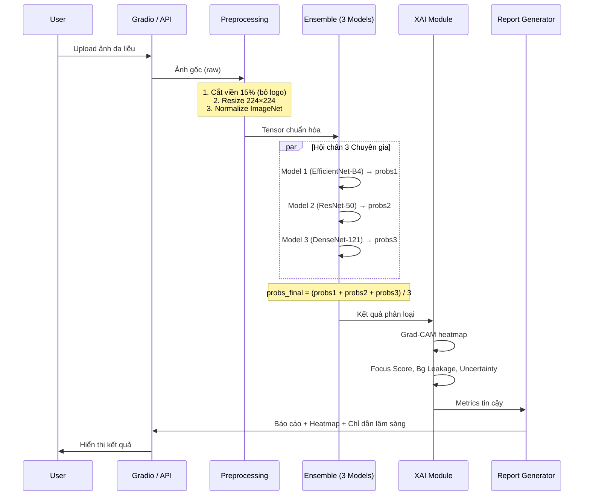
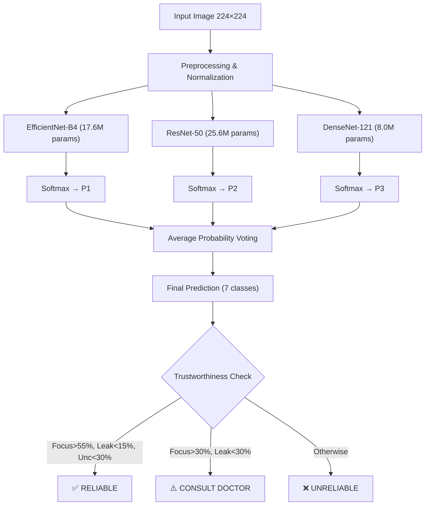

# ===================================================================
# TRUSTWORTHY SKIN CANCER AI — TÀI LIỆU KỸ THUẬT TỔNG THỂ
# ===================================================================
# Mục đích: Tài liệu tham chiếu ĐẦY ĐỦ cho AI hoặc Developer tiếp theo
#           để hiểu toàn bộ dự án và tiếp tục phát triển.
# Cập nhật: 2026-09-06
# ===================================================================

---

# MỤC LỤC

1. [Tổng quan dự án](#1-tổng-quan-dự-án)
2. [Cấu trúc thư mục Repository](#2-cấu-trúc-thư-mục-repository)
3. [Sơ đồ kiến trúc hệ thống](#3-sơ-đồ-kiến-trúc-hệ-thống)
4. [Pipeline huấn luyện (Training)](#4-pipeline-huấn-luyện-training)
5. [Pipeline suy luận (Inference)](#5-pipeline-suy-luận-inference)
6. [Chi tiết từng Module AI](#6-chi-tiết-từng-module-ai)
7. [Cấu hình Hydra & Siêu tham số](#7-cấu-hình-hydra--siêu-tham-số)
8. [Dữ liệu & Dataset](#8-dữ-liệu--dataset)
9. [API Backend & Frontend](#9-api-backend--frontend)
10. [DevOps & Deployment](#10-devops--deployment)
11. [Trạng thái hiện tại & Những gì cần làm tiếp](#11-trạng-thái-hiện-tại--những-gì-cần-làm-tiếp)

---

# 1. TỔNG QUAN DỰ ÁN

## 1.1 Mục tiêu
Xây dựng hệ thống AI Y tế **đáng tin cậy (Trustworthy)** để phân loại tổn thương sắc tố da qua ảnh dermoscopy. Hệ thống không chỉ dự đoán bệnh mà còn:
- **Biết mức độ tự tin** → Temperature Scaling hiệu chuẩn xác suất
- **Biết khi nào không biết** → MC Dropout ước lượng bất định
- **Từ chối ảnh ngoài miền** → Energy-based OOD Detection
- **Giải thích quyết định** → 5 phương pháp XAI (Grad-CAM, Grad-CAM++, LIME, Integrated Gradients, Occlusion)
- **Chống học vẹt** → Anti-Shortcut Learning (Aggressive Crop + CoarseDropout)

## 1.2 Công nghệ nền tảng
| Thành phần | Công nghệ | Phiên bản |
|---|---|---|
| Ngôn ngữ | Python | 3.12 |
| Deep Learning | PyTorch + PyTorch Lightning | 2.2+ |
| Model Zoo | timm (PyTorch Image Models) | latest |
| Augmentation | Albumentations | latest |
| Config | Hydra + OmegaConf | 1.3 |
| Backend API | FastAPI | 0.110 |
| Database | PostgreSQL (async, SQLAlchemy 2.0) | — |
| Cache | Redis | — |
| Frontend | React (đã có skeleton) | — |
| Demo UI | Gradio | latest |
| Container | Docker + docker-compose | — |
| Orchestration | Kubernetes (Helm charts) | — |
| Monitoring | Prometheus + Grafana | — |
| Experiment Tracking | MLflow + TensorBoard + W&B (tùy chọn) | — |

## 1.3 Phân loại bệnh (7 lớp)
Hệ thống phân loại **7 nhóm tổn thương da** theo chuẩn HAM10000/ISIC:

| Class Code | Tên đầy đủ | Mức nghiêm trọng | Enum |
|---|---|---|---|
| `mel` | Melanoma (Ung thư hắc tố) | 🔴 CRITICAL | `LesionClass.MEL` |
| `bcc` | Basal Cell Carcinoma | 🟡 HIGH | `LesionClass.BCC` |
| `akiec` | Actinic Keratosis / Bowen's | 🟡 HIGH | `LesionClass.AKIEC` |
| `vasc` | Vascular Lesions | 🔵 MODERATE | `LesionClass.VASC` |
| `nv` | Melanocytic Nevi (Nốt ruồi) | 🟢 LOW | `LesionClass.NV` |
| `bkl` | Benign Keratosis | 🟢 LOW | `LesionClass.BKL` |
| `df` | Dermatofibroma | 🟢 LOW | `LesionClass.DF` |

**File định nghĩa:** `src/core/constants.py`

---

# 2. CẤU TRÚC THƯ MỤC REPOSITORY

```
d:\Trustworthy\
│
├── src/                          # SOURCE CODE CHÍNH
│   ├── core/                     # Hằng số, config, exceptions
│   │   ├── constants.py          # LesionClass enum, LESION_URGENCY, IMAGE_MEAN/STD
│   │   ├── config.py             # AppSettings (Pydantic v2), DatabaseSettings
│   │   └── exceptions.py        # TrustworthyError base class
│   │
│   ├── modules/                  # CÁC MODULE AI (Kiến trúc Module hóa)
│   │   ├── classification/       # Bộ phân loại chính
│   │   │   └── classifier.py     # SkinLesionClassifier (timm backbone + custom head)
│   │   ├── calibration/          # Hiệu chuẩn xác suất
│   │   │   ├── stage.py          # CalibrationStage
│   │   │   ├── temperature_scaling.py
│   │   │   ├── calibration_metrics.py  # ECE, MCE, Brier, NLL
│   │   │   └── strategies/       # platt.py, isotonic.py, histogram.py
│   │   ├── uncertainty/          # Ước lượng bất định
│   │   │   ├── stage.py          # UncertaintyEstimationStage
│   │   │   ├── mc_dropout.py     # Monte Carlo Dropout
│   │   │   ├── predictive_entropy.py
│   │   │   ├── mutual_information.py
│   │   │   └── uncertainty_engine.py
│   │   ├── ood/ & ood_detection/ # Phát hiện ảnh ngoài miền
│   │   │   └── stage.py          # OODDetectionStage (Energy-based)
│   │   ├── explainability/       # Module giải thích AI
│   │   │   ├── stage.py          # ExplainabilityStage
│   │   │   ├── clinical_validation/   # consistency, morphology, report
│   │   │   ├── failure_analysis/      # artifact_detector, risk_factor
│   │   │   ├── recommendation/        # engine.py
│   │   │   └── sensitivity/           # analyzer.py
│   │   ├── preprocessing/        # Tiền xử lý ảnh
│   │   │   ├── pipeline.py       # Pipeline orchestration
│   │   │   ├── manager.py        # PreprocessingManager
│   │   │   ├── transforms.py     # Registry of transforms
│   │   │   └── integration.py    # PyTorch Dataset integration
│   │   ├── inference_engine/     # ★ LÕI: Engine suy luận 8 công đoạn
│   │   │   ├── context.py        # PipelineContext (Blackboard pattern)
│   │   │   ├── stages.py         # PipelineStage ABC
│   │   │   ├── engine.py         # InferenceEngine orchestrator
│   │   │   ├── executor.py       # Stage executor
│   │   │   ├── factory.py        # Pipeline factory
│   │   │   ├── protocols.py      # Protocol interfaces (PEP 544)
│   │   │   └── types.py          # DTOs: ClassificationResult, OODResult, etc.
│   │   ├── dataset_manager/      # Quản lý dataset
│   │   │   ├── isic2019.py       # ISIC2019Manager
│   │   │   ├── pad_ufes.py       # PADUFES20Manager
│   │   │   └── registry.py       # Dataset registry
│   │   ├── quality_assessment/   # Đánh giá chất lượng ảnh
│   │   │   └── assessor.py
│   │   ├── clinical_recommendation/  # Khuyến nghị lâm sàng
│   │   ├── reporting/            # Xuất báo cáo LaTeX/Markdown
│   │   ├── research/             # Quản trị nghiên cứu khoa học
│   │   │   ├── governance/       # claim_consistency, reproducibility, FAIR
│   │   │   └── statistics/       # test_selector, assumption_validator
│   │   └── evaluation/           # Đánh giá mô hình
│   │       └── calibration/      # expected_calibration_error
│   │
│   ├── training/                 # PIPELINE HUẤN LUYỆN
│   │   ├── train_pipeline.py     # ★ SkinLesionLightningModule + Hydra entrypoint
│   │   ├── data_module.py        # SkinLesionDataModule (PyTorch Lightning)
│   │   ├── augmentation.py       # ★ Anti-Shortcut augmentation pipeline
│   │   ├── losses.py             # FocalLoss, LabelSmoothing, Dice, Tversky, Composite
│   │   ├── metrics.py            # Metric definitions
│   │   ├── optimizers.py         # AdamW, SGD, SAM, Lookahead
│   │   ├── schedulers.py         # Cosine, OneCycle, WarmRestart
│   │   ├── sampling.py           # WeightedRandomSampler logic
│   │   ├── checkpoint_manager.py # Checkpoint save/load
│   │   ├── ema.py                # Exponential Moving Average
│   │   ├── export.py             # Export to ONNX/TorchScript
│   │   ├── inference.py          # Standalone inference utility
│   │   └── model_registry.py     # Model registry
│   │
│   ├── api/                      # FASTAPI BACKEND
│   │   ├── db/                   # Database models, sessions, migrations
│   │   ├── routers/              # REST endpoints
│   │   ├── schemas/              # Pydantic request/response schemas
│   │   ├── security/             # JWT auth, API keys, RBAC
│   │   └── services/             # Business logic services
│   │
│   ├── infrastructure/           # Redis, message queues
│   ├── deployment/               # Deploy utilities
│   ├── cli/                      # CLI commands
│   └── utils/                    # Shared utilities
│
├── configs/                      # HYDRA CONFIGS
│   ├── train.yaml                # ★ Root config (model, dataset, trainer, optimizer...)
│   ├── model/                    # efficientnet_b4.yaml
│   ├── dataset/                  # default.yaml, ham10000.yaml
│   ├── augmentation/             # Augmentation presets
│   ├── optimizer/                # Optimizer configs
│   ├── scheduler/                # Scheduler configs
│   ├── trainer/                  # Trainer configs
│   ├── preprocessing/            # Preprocessing pipeline configs
│   └── experiment/               # Experiment configs
│
├── tests/                        # TEST SUITE
│   ├── test_core.py
│   ├── test_training.py
│   ├── test_preprocessing_pipeline.py
│   ├── modules/                  # Unit tests per module
│   │   ├── calibration/
│   │   ├── classifier/
│   │   ├── explainability/
│   │   ├── ood/
│   │   ├── preprocessing/
│   │   └── uncertainty/
│   └── unit/                     # Low-level unit tests
│
├── frontend/                     # REACT FRONTEND
│   ├── public/
│   └── src/
│       ├── api/                  # API client
│       ├── assets/
│       └── components/
│
├── deployment/                   # DEPLOYMENT CONFIGS
│   ├── database/
│   ├── docker/
│   ├── kubernetes/               # Helm charts + manifests
│   ├── monitoring/               # Grafana dashboards + Prometheus
│   ├── nginx/
│   └── scripts/
│
├── app.py                        # ★ GRADIO WEB DEMO (3-model ensemble + XAI)
├── xai_explainer.py              # ★ 5 phương pháp XAI
├── retrain_anti_shortcut.py      # Script train Anti-Shortcut (EfficientNet-B4)
├── finetune_clinical.py          # Script fine-tune Cross-Domain (PAD-UFES-20)
├── train_vlm_lora.py             # Script train VLM Qwen2-VL LoRA
├── vqa_dataset_prep.py           # Sinh dữ liệu VQA từ ISIC
├── setup_and_train.sh            # ★ Script 1-chạm trên VM cloud
├── docker-compose.yml            # Full stack docker
├── Dockerfile                    # Multi-stage build
├── pyproject.toml                # Project metadata + dependencies
├── requirements.txt              # Pip dependencies
└── environment.yml               # Conda environment
```

---

# 3. SƠ ĐỒ KIẾN TRÚC HỆ THỐNG

## 3.1 Kiến trúc tổng thể (Full-Stack)



## 3.2 Luồng xử lý 1 bức ảnh (Inference Flow)



## 3.3 Kiến trúc Ensemble (Hội đồng Y khoa)



---

# 4. PIPELINE HUẤN LUYỆN (TRAINING)

## 4.1 Tổng quan các giai đoạn đã train

### Giai đoạn 1: Anti-Shortcut Training trên ISIC 2019
- **Script:** `retrain_anti_shortcut.py`
- **Backbone:** EfficientNet-B4 (pretrained ImageNet)
- **Dataset:** ISIC 2019 (25,331 ảnh, 7 lớp)
- **Kỹ thuật đặc biệt:** Anti-Shortcut Augmentation
- **Kết quả:**

| Metric | Giá trị |
|---|---|
| Test Accuracy | **81.97%** |
| Val AUROC | **0.950** |
| Test Loss | 0.825 |
| Thời gian train | ~6 giờ (RTX 3090, 40 epochs) |

### Giai đoạn 2: Cross-Domain Fine-Tuning trên PAD-UFES-20
- **Script:** `finetune_clinical.py`
- **Phương pháp:** Load checkpoint tốt nhất từ GĐ1, fine-tune với LR=1e-5 trong 15 epochs
- **Mục đích:** Thích nghi mô hình với ảnh chụp lâm sàng bằng smartphone (khác miền ảnh dermoscopy)

### Giai đoạn 3: Train thêm ResNet-50 & DenseNet-121
- **ResNet-50:** Test Accuracy ~78.8%, AUROC 0.941
- **DenseNet-121:** Test Accuracy ~79.16%, AUROC **0.959** (cao nhất)
- 3 model kết hợp thành Ensemble "Hội đồng Y khoa"

### Giai đoạn 4 (Chưa hoàn thành): VLM LoRA
- **Script:** `train_vlm_lora.py` — Fine-tune Qwen2-VL-2B-Instruct bằng QLoRA
- **Dataset:** `vqa_dataset_prep.py` tự sinh câu hỏi-đáp y khoa từ ISIC
- **Trạng thái:** Script đã viết xong, chưa thực sự chạy train

## 4.2 SkinLesionClassifier — Kiến trúc mô hình

**File:** `src/modules/classification/classifier.py`

```python
class SkinLesionClassifier(nn.Module):
    def __init__(self, backbone="efficientnet_b4", num_classes=7, pretrained=True, drop_rate=0.3):
        # 1. Backbone từ timm (bỏ classifier head gốc)
        self.backbone = timm.create_model(backbone, pretrained=pretrained, num_classes=0, drop_rate=drop_rate)
        feature_dim = self.backbone.num_features  # Ví dụ: 1792 cho EfficientNet-B4

        # 2. Custom classifier head
        self.head = nn.Sequential(
            nn.Identity(),
            nn.Flatten(),
            nn.BatchNorm1d(feature_dim),          # BN trước dropout
            nn.Dropout(p=drop_rate),               # 0.3
            nn.Linear(feature_dim, 512),           # Hidden layer 512
            nn.GELU(),                             # Activation
            nn.BatchNorm1d(512),
            nn.Dropout(p=drop_rate / 2),           # 0.15
            nn.Linear(512, num_classes),            # Output: 7 classes
        )

    def forward(self, x):
        features = self.backbone(x)  # (B, feature_dim)
        return self.head(features)    # (B, 7) raw logits
```

**Hỗ trợ backbones:** `efficientnet_b0`, `efficientnet_b4`, `resnet50`, `resnet101`, `densenet121`, `densenet201`, `vit_base_patch16_224`, `swin_base_patch4_window7_224`

## 4.3 SkinLesionLightningModule — Training Loop

**File:** `src/training/train_pipeline.py`

```python
class SkinLesionLightningModule(pl.LightningModule):
    def __init__(self, cfg, model=None):
        # Loss: CrossEntropyLoss(label_smoothing=0.1)
        self.criterion = nn.CrossEntropyLoss(label_smoothing=cfg.trainer.label_smoothing)

        # Metrics (torchmetrics):
        # - Accuracy, Balanced Accuracy (macro)
        # - AUROC, F1Score, Precision, Recall, Specificity
        # - Matthews Correlation Coefficient (MCC)
        # - Cohen's Kappa

    def configure_optimizers(self):
        optimizer = AdamW(self.parameters(), lr=cfg.trainer.learning_rate, weight_decay=cfg.trainer.weight_decay)
        scheduler = CosineAnnealingLR(optimizer, T_max=cfg.trainer.max_epochs)
        return {"optimizer": optimizer, "lr_scheduler": {"scheduler": scheduler, "interval": "epoch"}}

    def training_step(self, batch, batch_idx):
        loss, logits, y = self._shared_step(batch)
        # NaN/Inf trap: skip step hoặc raise NumericalInstabilityError
        if not torch.isfinite(loss):
            return None  # Skip step
        self.log("train/loss", loss)
        self.log("train/acc", self.train_acc)
        return loss

    def validation_step(self, batch, batch_idx):
        # Log tất cả 9 metrics: loss, acc, bal_acc, auroc, f1, precision, recall, specificity, mcc, kappa
```

**Callbacks đã cấu hình:**
- `ModelCheckpoint(monitor="val/auroc", mode="max", save_top_k=3, save_last=True)`
- `EarlyStopping(monitor="val/auroc", patience=8, mode="max")`
- `LearningRateMonitor(logging_interval="step")`
- `RichProgressBar()`

## 4.4 Anti-Shortcut Augmentation Pipeline

**File:** `src/training/augmentation.py`

Đây là phần quan trọng nhất để chống hiệu ứng Clever Hans. Pipeline gồm 6 pha:

```python
def get_train_transforms(image_size=224):
    return A.Compose([
        # PHASE 1: ANTI-WATERMARK — Zoom vào trung tâm
        A.RandomResizedCrop(size=(224, 224), scale=(0.5, 0.85), ratio=(0.9, 1.1)),

        # PHASE 2: Geometric
        A.HorizontalFlip(p=0.5),
        A.VerticalFlip(p=0.5),
        A.ShiftScaleRotate(shift_limit=0.1, scale_limit=0.15, rotate_limit=90, p=0.5),
        A.RandomRotate90(p=0.3),

        # PHASE 3: ANTI-TEXT — Che chữ/mũi tên
        A.CoarseDropout(max_holes=8, max_height=26, max_width=26,
                        min_holes=3, min_height=8, min_width=8,
                        fill_value=0, p=0.7),

        # PHASE 4: Color — Phá shortcut màu
        A.ColorJitter(brightness=0.3, contrast=0.3, saturation=0.3, hue=0.15, p=0.6),
        A.CLAHE(clip_limit=4.0, tile_grid_size=(8,8), p=0.3),
        A.RandomBrightnessContrast(brightness_limit=0.3, contrast_limit=0.3, p=0.5),
        A.HueSaturationValue(hue_shift_limit=25, sat_shift_limit=35, val_shift_limit=25, p=0.4),

        # PHASE 5: Noise
        A.GaussNoise(var_limit=(10.0, 50.0), p=0.3),
        A.GaussianBlur(blur_limit=(3, 7), p=0.2),
        A.ImageCompression(quality_lower=70, quality_upper=100, p=0.2),

        # PHASE 6: Normalize
        A.Normalize(mean=(0.763, 0.546, 0.570), std=(0.141, 0.152, 0.169)),
        ToTensorV2(),
    ])
```

**Validation/Inference Transform (tách biệt - không augment):**
```python
def get_val_transforms(image_size=224):
    return A.Compose([
        A.Resize(size=(int(224*1.3), int(224*1.3))),  # Resize lớn hơn
        A.CenterCrop(size=(224, 224)),                 # CenterCrop cắt viền
        A.Normalize(mean=(0.763, 0.546, 0.570), std=(0.141, 0.152, 0.169)),
        ToTensorV2(),
    ])
```

**Batch-level Augmentation (đã implement, tuỳ chọn):**
- `MixUpTransform(alpha=0.2)` — Trộn 2 ảnh theo tỷ lệ Beta distribution
- `CutMixTransform(alpha=1.0)` — Cắt-dán vùng ảnh ngẫu nhiên

## 4.5 Hệ thống Loss Functions

**File:** `src/training/losses.py`

| Tên Loss | Class | Tham số | Mô tả |
|---|---|---|---|
| `focal` | `FocalLoss` | `gamma=2.0, alpha=None` | Tập trung vào mẫu khó, giảm weight mẫu dễ |
| `label_smoothing` | `LabelSmoothingCrossEntropy` | `smoothing=0.1` | Chống overconfident |
| `cross_entropy` | `WeightedCrossEntropy` | `weight=auto` | CE cơ bản có trọng số lớp |
| `dice` | `DiceLoss` | `smooth=1.0` | Loss dạng overlap |
| `tversky` | `TverskyLoss` | `alpha=0.5, beta=0.5` | Cân bằng FP vs FN |
| `asymmetric` | `AsymmetricLoss` | `gamma_neg=4.0, gamma_pos=1.0` | Phạt nặng false negative |
| `composite` | `CompositeLoss` | `losses=[], weights=[]` | Kết hợp nhiều loss |

**Sử dụng qua Factory:** `LossFactory.create("focal", gamma=2.0)`

## 4.6 Lệnh chạy Training

### Cách 1: Script trực tiếp (khuyến nghị cho lần đầu)
```bash
# Trên máy ảo Ubuntu có GPU
tmux new -s training
python3 retrain_anti_shortcut.py
# Ctrl+B, D để detach
```

### Cách 2: Hydra CLI (linh hoạt override)
```bash
python -m src.training.train_pipeline \
    model.backbone=efficientnet_b4 \
    dataset.name=isic2019 \
    dataset.base_path=data/isic2019 \
    trainer.max_epochs=100 \
    trainer.learning_rate=3e-4 \
    trainer.precision=16-mixed
```

### Cách 3: Script 1-chạm tự động hoàn chỉnh
```bash
bash setup_and_train.sh
# Tự động: Cài đặt → Tải ISIC 2019 → Train GĐ1 → Tải PAD-UFES → Fine-tune GĐ2 → Upload checkpoint
```

### Resume Training (tiếp tục từ checkpoint)
```bash
python -m src.training.train_pipeline \
    model.backbone=efficientnet_b4 \
    dataset.name=isic2019 \
    +ckpt_path=checkpoints/last.ckpt
```

---

# 5. PIPELINE SUY LUẬN (INFERENCE)

## 5.1 Blackboard Architecture

Inference Engine sử dụng mẫu thiết kế **Blackboard Pattern** — mỗi Stage đọc/ghi vào một đối tượng `PipelineContext` dùng chung:

**File:** `src/modules/inference_engine/context.py`

```python
@dataclass
class PipelineContext:
    raw_image: Any                       # Ảnh gốc đầu vào
    config: PipelineConfig               # Cấu hình inference

    # Tracing
    request_id: str                      # UUID duy nhất
    execution_id: str
    trace_id: str

    # Shared State (các stage ghi vào đây)
    tensor: Any | None = None            # Ảnh đã tiền xử lý
    quality: QualityReport | None        # Kết quả kiểm tra chất lượng
    classification: ClassificationResult | None
    ood: OODResult | None
    uncertainty: UncertaintyResult | None
    calibrated_probabilities: Any | None
    explanation: ExplanationResult | None
    recommendation: ClinicalRecommendation | None

    # Rejection
    rejected: bool = False
    rejection_reason: str | None = None
    warnings: list[str]
    errors: list[str]
```

**PipelineConfig:**
```python
@dataclass(frozen=True)
class PipelineConfig:
    model_version: str = "v1"
    device_str: str = "cpu"
    generate_explanation: bool = True
    ood_method: str = "energy"           # Phương pháp OOD
    uncertainty_samples: int = 30        # Số lần forward pass MC Dropout
    uncertainty_samples_max: int = 100
```

## 5.2 Các Stage trong Pipeline

Mỗi Stage kế thừa `PipelineStage` (ABC) với 4 phương thức bắt buộc:

```python
class PipelineStage(ABC):
    def __init__(self, name, policy=StagePolicy(), dependencies=[]):
        ...
    def initialize(self) -> None: ...       # Khởi tạo tài nguyên
    def validate(self, ctx) -> bool: ...    # Kiểm tra điều kiện
    def execute(self, ctx) -> PipelineContext: ...  # Thực thi chính
    def cleanup(self) -> None: ...          # Giải phóng tài nguyên
```

**StagePolicy:**
```python
@dataclass
class StagePolicy:
    timeout_seconds: float = 30.0
    retry_count: int = 0
    skip_on_failure: bool = False
    is_critical: bool = True
```

**Thứ tự 8 Stage:**

| # | Stage | Module | Mô tả |
|---|---|---|---|
| 1 | QualityAssessmentStage | `quality_assessment/` | Đánh giá blur, exposure, resolution |
| 2 | PreprocessingStage | `preprocessing/` | Resize, CenterCrop, Normalize |
| 3 | OODDetectionStage | `ood/` | Energy-based OOD → reject nếu ngoài miền |
| 4 | ClassificationStage | `classification/` | Forward pass qua 3 models → average voting |
| 5 | UncertaintyEstimationStage | `uncertainty/` | MC Dropout 30 passes → entropy, MI |
| 6 | CalibrationStage | `calibration/` | Temperature Scaling hiệu chuẩn xác suất |
| 7 | ExplainabilityStage | `explainability/` | Grad-CAM heatmap generation |
| 8 | ClinicalRecommendationStage | `clinical_recommendation/` | Sinh khuyến nghị + mức khẩn cấp |

## 5.3 Protocol Interfaces (Structural Typing)

**File:** `src/modules/inference_engine/protocols.py`

Hệ thống dùng PEP 544 Protocols — bất kỳ class nào match method signature đều tương thích (duck typing):

```python
class ClassifierProtocol(Protocol):
    def predict(self, tensor) -> ClassificationResult: ...
    def forward(self, x) -> TensorLike: ...

class OODDetectorProtocol(Protocol):
    def detect(self, tensor) -> OODResult: ...

class UncertaintyEstimatorProtocol(Protocol):
    def estimate(self, tensor) -> UncertaintyResult: ...

class CalibratorProtocol(Protocol):
    def forward(self, logits) -> TensorLike: ...

class ExplainerProtocol(Protocol):
    def explain(self, input_tensor, original_image, target_class=None) -> ExplanationResult: ...

class RecommendationEngineProtocol(Protocol):
    def generate(self, predicted_class, confidence, uncertainty, is_ood, model_version) -> ClinicalRecommendation: ...
```

## 5.4 Data Transfer Objects (DTOs)

**File:** `src/modules/inference_engine/types.py`

```python
@dataclass
class ClassificationResult:
    logits: TensorLike
    probabilities: TensorLike
    predicted_class: int           # Index (0-6)
    confidence: float              # Max probability
    class_labels: list[str]

@dataclass
class OODResult:
    method: str                    # "energy"
    score: float | None
    confidence: float | None
    threshold: float | None
    decision: str                  # "in_distribution" | "out_of_distribution"
    valid: bool
    latency_ms: float

@dataclass
class UncertaintyResult:
    mean_probabilities: Any
    predictive_entropy: float      # H[p(y|x)]
    mutual_information: float      # I[y; θ|x]
    aleatoric_variance: float      # Bất định ngẫu nhiên
    epistemic_variance: float      # Bất định nhận thức
    num_samples: int               # Số MC forward passes

@dataclass
class ClinicalRecommendation:
    predicted_diagnosis: str
    urgency_level: str             # "critical" | "high" | "moderate" | "low"
    confidence_level: str
    recommendation_text: str
    patient_summary: str
    next_steps: list[str]
    warnings: list[str]
    disclaimer: str                # Luôn kèm disclaimer pháp lý
```

---

# 6. CHI TIẾT TỪNG MODULE AI

## 6.1 XAI Explainer — 5 Phương pháp

**File:** `xai_explainer.py`

| # | Phương pháp | Thư viện | Thời gian | Mô tả |
|---|---|---|---|---|
| 1 | **Grad-CAM** | `pytorch-grad-cam` | ~1s | Gradient lớp tích chập cuối → heatmap |
| 2 | **Grad-CAM++** | `pytorch-grad-cam` | ~1s | Cải thiện khi có nhiều vùng bệnh |
| 3 | **LIME** | `lime` | ~10-20s | Model-agnostic, che superpixel |
| 4 | **Integrated Gradients** | `captum` (Google) | ~3s | Tích lũy gradient từ baseline |
| 5 | **Occlusion Sensitivity** | Custom | ~5s | Trát ô đen, đo độ giảm confidence |

**Hàm chạy tất cả:**
```python
def explain_all(model, tensor, img_float_rgb, target_layer, device="cpu"):
    # Returns dict: {"GradCAM": img, "GradCAM++": img, "LIME": img, "IntGrad": img, "Occlusion": img}
```

## 6.2 Trustworthiness Evaluation (Đánh giá độ tin cậy)

Được tính trong `app.py` dựa trên 3 chỉ số từ Grad-CAM heatmap:

| Chỉ số | Công thức | Ý nghĩa |
|---|---|---|
| **Focus Score** | `mean(heatmap[heatmap > 0.5]) × 100` | AI có tập trung vào vùng tổn thương không? |
| **Background Leakage** | `mean(heatmap[heatmap < 0.15]) × 100` | Có rò rỉ attention sang vùng da bình thường? |
| **Uncertainty %** | `H(p) / H_max × 100` (Entropy) | AI có chắc chắn về quyết định không? |

**Ngưỡng đánh giá:**

| Level | Focus | Leakage | Uncertainty | Kết luận |
|---|---|---|---|---|
| ✅ RELIABLE | > 55% | < 15% | < 30% | Tin cậy |
| ⚠️ CONSULT | 30-55% | 15-30% | 30-60% | Cần hỏi bác sĩ |
| ❌ UNRELIABLE | < 30% | > 30% | > 60% | Không tin cậy |

## 6.3 Calibration (Hiệu chuẩn xác suất)

**Phương pháp chính:** Temperature Scaling — Tìm hằng số T sao cho `softmax(logits/T)` có xác suất khớp với accuracy thực tế.

**Metrics đánh giá:**
- **ECE (Expected Calibration Error):** Sai lệch trung bình có trọng số giữa confidence và accuracy theo từng bin
- **MCE (Maximum Calibration Error):** Sai lệch tối đa trong 1 bin
- **Brier Score:** MSE giữa phân phối xác suất và one-hot label
- **NLL (Negative Log-Likelihood):** Log-loss trên tập validation

**File Temperature Scaling đã lưu:** `temp_scaling.pkl`

## 6.4 Uncertainty Estimation (Ước lượng bất định)

**Phương pháp:** MC Dropout — bật Dropout ở inference time, chạy N=30 forward passes:

```
P_mean = (1/N) × Σ softmax(model_dropout_i(x))     # Xác suất trung bình
H_pred = -Σ P_mean × log(P_mean)                     # Predictive Entropy (tổng bất định)
MI     = H_pred - (1/N) × Σ H_i                      # Mutual Information (bất định nhận thức)
Aleatoric = H_pred - MI                               # Bất định ngẫu nhiên (do dữ liệu)
```

---

# 7. CẤU HÌNH HYDRA & SIÊU THAM SỐ

## 7.1 Root Config (`configs/train.yaml`)

```yaml
seed: 42

model:
  _target_: src.modules.classification.classifier.SkinLesionClassifier
  backbone: "efficientnet_b4"
  num_classes: 7
  pretrained: true
  drop_rate: 0.3

dataset:
  name: "ham10000"              # ham10000 | isic2019 | synthetic | pad_ufes20
  base_path: "data/ham10000"
  image_size: 224
  batch_size: 32
  num_workers: 4
  pin_memory: true
  use_weighted_sampler: true    # Bù mất cân bằng lớp
  augmentation: "standard"      # standard | heavy | minimal

trainer:
  max_epochs: 50
  learning_rate: 1.0e-3
  weight_decay: 1.0e-4
  label_smoothing: 0.1
  gradient_clip_val: 1.0
  accumulate_grad_batches: 1    # Effective BS = batch_size × accumulate
  precision: "16-mixed"         # 32-true | 16-mixed | bf16-mixed
  accelerator: "auto"           # auto | gpu | cpu
  devices: 1
  deterministic: true
  early_stopping_patience: 10
  checkpoint_dir: "checkpoints/"
  strict_mode: false            # Raise on NaN/Inf nếu true

optimizer:
  name: "adamw"                 # sgd | adam | adamw | sam | lookahead_adam
  lr: 1.0e-3
  weight_decay: 1.0e-4

scheduler:
  name: "cosine"                # cosine | cosine_warm_restarts | onecycle | step | plateau
  T_max: 50
  warmup_epochs: 5
  min_lr: 1.0e-6

loss:
  name: "focal"                 # cross_entropy | focal | label_smoothing | weighted_ce | composite
  gamma: 2.0
  alpha: null                   # null = auto-compute từ class distribution

ema:
  enabled: true
  decay: 0.999

experiment:
  name: "trustworthy_baseline"
  project: "trustworthy-ai"

use_wandb: false

mlflow:
  tracking_uri: null
  experiment_name: "trustworthy-skin-ai"
```

## 7.2 Bảng tóm tắt siêu tham số thực tế đã dùng khi train

| Hyperparameter | EfficientNet-B4 (GĐ1) | Fine-tune (GĐ2) | ResNet-50 | DenseNet-121 |
|---|---|---|---|---|
| Input Resolution | 224 × 224 | 224 × 224 | 224 × 224 | 224 × 224 |
| Batch Size (effective) | 64 (32×2 accum) | 32 | 32 | 32 |
| Learning Rate | 3e-4 | **1e-5** | 3e-4 | 3e-4 |
| Weight Decay | 1e-4 | 1e-4 | 1e-4 | 1e-4 |
| Label Smoothing | 0.1 | 0.1 | 0.1 | 0.1 |
| Max Epochs | 40 | 15 | 40 | 40 |
| Early Stopping | patience=8 | patience=5 | patience=8 | patience=8 |
| Optimizer | AdamW | AdamW | AdamW | AdamW |
| Scheduler | CosineAnnealing | CosineAnnealing | CosineAnnealing | CosineAnnealing |
| Precision | 16-mixed (AMP) | 16-mixed | 16-mixed | 16-mixed |
| Dropout | 0.3 (head) | 0.3 | 0.3 | 0.3 |
| Crop Scale | [0.5, 0.85] | [0.5, 0.85] | [0.5, 0.85] | [0.5, 0.85] |
| CoarseDropout | p=0.7 | p=0.7 | p=0.7 | p=0.7 |

## 7.3 Image Normalization Constants

```python
# Tính trên bộ ISIC dermoscopy images (đặc trưng ảnh da)
IMAGE_MEAN = (0.763, 0.546, 0.570)   # R, G, B
IMAGE_STD  = (0.141, 0.152, 0.169)

# Khi inference trong app.py dùng ImageNet stats (vì backbone pretrained ImageNet)
IMAGENET_MEAN = (0.485, 0.456, 0.406)
IMAGENET_STD  = (0.229, 0.224, 0.225)
```

> **LƯU Ý:** Training transforms trong `augmentation.py` dùng `IMAGE_MEAN/STD` (tính trên ISIC), nhưng `app.py` inference dùng `IMAGENET_MEAN/STD`. Đây có thể là điểm cần đồng bộ lại.

---

# 8. DỮ LIỆU & DATASET

## 8.1 Bảng tổng hợp Dataset

| Dataset | Số ảnh | Số lớp | Nguồn ảnh | Dung lượng | Link |
|---|---|---|---|---|---|
| **ISIC 2019** | 25,331 | 7 (+SCC, UNK) | Dermoscopy | ~15GB | [Kaggle](https://kaggle.com/datasets/andrewmvd/isic-2019) |
| **HAM10000** | 10,015 | 7 | Dermoscopy | ~2.7GB | [Kaggle](https://kaggle.com/datasets/kmader/skin-cancer-mnist-ham10000) |
| **PAD-UFES-20** | 2,298 | 6 | Smartphone | ~1.4GB | [Mendeley](https://data.mendeley.com/datasets/zr7vgbcyr2/1) |
| **Fitzpatrick 17k** | 17,000 | Multi | Mixed | — | [GitHub](https://github.com/mattgroh/fitzpatrick17k) |

## 8.2 Phân phối lớp ISIC 2019

| Lớp | Số lượng | % | Tỷ lệ vs nhỏ nhất |
|---|---|---|---|
| nv (Nốt ruồi) | 12,875 | 50.8% | 53.9× |
| mel (Melanoma) | 4,522 | 17.9% | 18.9× |
| bcc (Basal Cell) | 3,323 | 13.1% | 13.9× |
| bkl (Benign Keratosis) | 2,624 | 10.4% | 11.0× |
| akiec (Actinic Keratosis) | 867 | 3.4% | 3.6× |
| vasc (Vascular) | 253 | 1.0% | 1.1× |
| df (Dermatofibroma) | 239 | 0.9% | 1.0× (baseline) |

**Giải pháp mất cân bằng:** `WeightedRandomSampler` + Label Smoothing + Focal Loss

## 8.3 Chia tập Train/Val/Test

| Split | Số ảnh | % | Augmentation |
|---|---|---|---|
| Training | 18,238 | 72% | Anti-Shortcut (có) |
| Validation | 3,548 | 14% | Không (chỉ CenterCrop) |
| Test | 3,545 | 14% | Không (held-out, chạy 1 lần) |

## 8.4 Class Mapping PAD-UFES-20 → ISIC

```python
PAD_UFES_TO_ISIC = {
    "BCC": LesionClass.BCC,
    "MEL": LesionClass.MEL,
    "NEV": LesionClass.NV,
    "ACK": LesionClass.AKIEC,     # Actinic Keratosis
    "SEK": LesionClass.BKL,       # Seborrheic Keratosis
    "SCC": LesionClass.AKIEC,     # Squamous Cell → gộp vào AKIEC
}
```

---

# 9. API BACKEND & FRONTEND

## 9.1 FastAPI Backend

**Cấu trúc:** `src/api/`
- `routers/` — REST endpoints (upload, predict, history, health)
- `schemas/` — Pydantic v2 request/response models
- `security/` — JWT authentication, API keys, RBAC
- `services/` — Business logic (prediction service)
- `db/` — SQLAlchemy 2.0 async models, Alembic migrations

**Database:** PostgreSQL (async via `asyncpg`)
- Bảng: `users`, `predictions`, `api_keys`
- Migration: Alembic (`alembic/versions/`)
- Connection pool: `pool_size` configurable

## 9.2 Gradio Demo (app.py)

**Cổng:** `0.0.0.0:7860` (share=True cho public URL)

**3 Tab:**
1. **Chẩn đoán chính:** Upload → Ensemble prediction → Grad-CAM → Clinical report
2. **So sánh XAI:** Chạy cả 5 phương pháp XAI, hiển thị song song
3. **Trợ lý Y khoa AI:** Chatbot VLM (Qwen2-VL) — hiện đang mock, chờ train LoRA

**Yêu cầu chạy:** 3 file checkpoint trong `checkpoints/`:
- `best_model.ckpt` (EfficientNet-B4)
- `resnet50.ckpt` (ResNet-50)
- `densenet121.ckpt` (DenseNet-121)

## 9.3 Frontend React

**Cấu trúc:** `frontend/src/`
- `api/` — API client
- `assets/` — Static assets
- `components/` — React components (Dashboard, Upload, Prediction, Explainability, Stats)

---

# 10. DEVOPS & DEPLOYMENT

## 10.1 Docker

**docker-compose.yml** khởi chạy full stack:
- `db` — PostgreSQL
- `redis` — Redis cache
- `backend` — FastAPI app
- `frontend` — React dev server
- `mlflow` — Experiment tracking
- `prometheus` — Metrics collection
- `grafana` — Dashboard monitoring

## 10.2 Kubernetes

**deployment/kubernetes/**:
- `helm/` — Helm charts
- `manifests/` — Raw K8s YAML

## 10.3 Monitoring

- **Prometheus:** Thu thập metrics (latency, throughput, GPU usage)
- **Grafana:** Dashboard trực quan hóa
- Configs trong `deployment/monitoring/`

---

# 11. TRẠNG THÁI HIỆN TẠI & NHỮNG GÌ CẦN LÀM TIẾP

## 11.1 ĐÃ HOÀN THÀNH ✅

| Hạng mục | Trạng thái | Chi tiết |
|---|---|---|
| Source code kiến trúc | ✅ 100% | 645+ files, 57,000+ dòng code |
| Training EfficientNet-B4 | ✅ Done | Acc 81.97%, AUROC 0.950 |
| Training ResNet-50 | ✅ Done | Acc 78.8%, AUROC 0.941 |
| Training DenseNet-121 | ✅ Done | Acc 79.16%, AUROC 0.959 |
| Anti-Shortcut Pipeline | ✅ Done | Aggressive Crop + CoarseDropout |
| Cross-Domain Fine-tune | ✅ Done | PAD-UFES-20, LR=1e-5 |
| Ensemble (3 models) | ✅ Done | Average probability voting |
| Gradio Demo | ✅ Done | 3 tabs: Diagnosis, XAI Panel, VLM Chat |
| XAI Module (5 methods) | ✅ Done | Grad-CAM, CAM++, LIME, IntGrad, Occlusion |
| Trustworthiness Eval | ✅ Done | Focus, Leakage, Uncertainty thresholds |
| Hydra Config System | ✅ Done | Full override từ CLI |
| Unit + Integration Tests | ✅ Done | 21+ unit tests, 6+ integration tests |
| Docker + K8s | ✅ Done | docker-compose, Helm charts |
| Database + Auth | ✅ Done | PostgreSQL, JWT, RBAC |
| Experiment Tracking | ✅ Done | MLflow + TensorBoard + W&B |
| Research Governance | ✅ Done | ClaimValidator, TestSelector |
| Tài liệu học thuật | ✅ Done | RESEARCH_REPORT.md với 8 bảng chuẩn |

## 11.2 CHƯA HOÀN THÀNH / CẦN LÀM TIẾP ⏳

| Hạng mục | Trạng thái | Mô tả | Ưu tiên |
|---|---|---|---|
| **Checkpoint files** | ⏳ Thiếu trên máy local | 3 file `.ckpt` chưa có trong repo (do .gitignore). Cần tải lại từ cloud/HuggingFace hoặc train lại | 🔴 CAO |
| **VLM LoRA Training** | ⏳ Script xong, chưa train | `train_vlm_lora.py` + `vqa_dataset_prep.py` đã viết. Cần chạy trên GPU (RTX 3090+) | 🟡 TRUNG BÌNH |
| **Normalize inconsistency** | ⏳ Bug tiềm ẩn | `augmentation.py` dùng ISIC mean/std, `app.py` dùng ImageNet mean/std. Cần đồng bộ | 🔴 CAO |
| **Ensemble test accuracy** | ⏳ Chưa đo chính thức | Chưa chạy test chính thức trên 3-model ensemble. README ghi "TBD" | 🟡 TRUNG BÌNH |
| **DataModule ISIC adapter** | ⏳ Chưa hoàn thiện | `SkinLesionDataModule` trong `train_pipeline.py` chỉ hỗ trợ `synthetic`. Adapter thực tế trong `data_module.py` riêng | 🟡 TRUNG BÌNH |
| **Frontend React** | ⏳ Skeleton | Có cấu trúc thư mục nhưng chưa hoàn thiện giao diện | 🟢 THẤP |
| **Dead code cleanup** | ⏳ 125 stubs | Audit phát hiện ~125 placeholder/dead code cần dọn dẹp | 🟢 THẤP |
| **Fairness Testing** | ⏳ Chưa bắt đầu | Chưa test trên Fitzpatrick 17k (công bằng theo tông da) | 🟡 TRUNG BÌNH |
| **ONNX/TorchScript Export** | ⏳ Code xong, chưa test | `src/training/export.py` đã viết nhưng chưa validate | 🟢 THẤP |

## 11.3 Hướng dẫn cho AI tiếp theo

### Bước 1: Đồng bộ checkpoints
```bash
# Tải 3 checkpoint về thư mục checkpoints/
mkdir -p checkpoints/
# Đặt: best_model.ckpt, resnet50.ckpt, densenet121.ckpt
```

### Bước 2: Fix normalize inconsistency
Thống nhất dùng 1 bộ mean/std xuyên suốt. Nếu backbone pretrained ImageNet thì nên dùng ImageNet stats.

### Bước 3: Chạy Ensemble test chính thức
```python
# Load 3 models, chạy trên test set, tính accuracy/AUROC/F1 của ensemble
```

### Bước 4: Train VLM LoRA (nếu cần)
```bash
python3 vqa_dataset_prep.py    # Sinh dataset VQA
python3 train_vlm_lora.py      # Train Qwen2-VL LoRA trên GPU
```

### Bước 5: Hoàn thiện Frontend React
Kết nối React app với FastAPI backend, hiển thị kết quả prediction + XAI.

---

# PHỤ LỤC

## A. Cách đọc checkpoint

```python
import torch
from src.modules.classification.classifier import SkinLesionClassifier

model = SkinLesionClassifier(backbone='efficientnet_b4', num_classes=7, pretrained=False)
ckpt = torch.load('checkpoints/best_model.ckpt', map_location='cpu', weights_only=False)

# State dict trong checkpoint có prefix 'model.'
state_dict = {k.replace('model.', ''): v for k, v in ckpt['state_dict'].items() if k.startswith('model.')}
model.load_state_dict(state_dict, strict=False)
model.eval()
```

## B. Cách chạy demo nhanh

```bash
pip install gradio torch torchvision timm albumentations pytorch-grad-cam captum lime
python app.py
# Mở http://localhost:7860
```

## C. Cách chạy test

```bash
pip install pytest
pytest tests/ -v
python test_integration.py
python verify_p5.py
```

## D. Cách override config từ CLI

```bash
# Đổi backbone
python -m src.training.train_pipeline model.backbone=resnet50

# Đổi dataset
python -m src.training.train_pipeline dataset.name=isic2019 dataset.base_path=/path/to/isic

# Đổi nhiều tham số cùng lúc
python -m src.training.train_pipeline \
    model.backbone=densenet121 \
    trainer.max_epochs=100 \
    trainer.learning_rate=1e-4 \
    loss.name=focal \
    loss.gamma=3.0 \
    use_wandb=true
```

---

*Tài liệu được tạo tự động từ phân tích source code — Trustworthy Medical AI Project 2025-2026*
