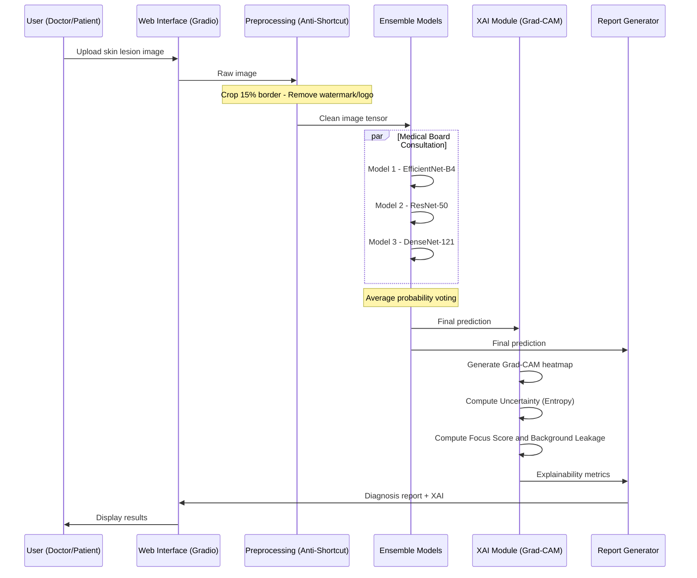
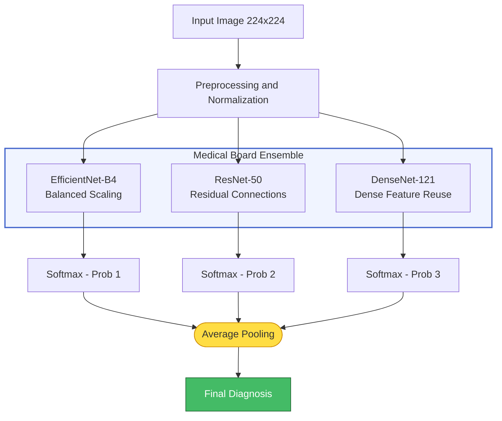
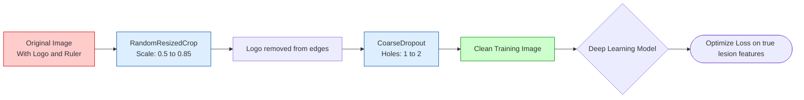
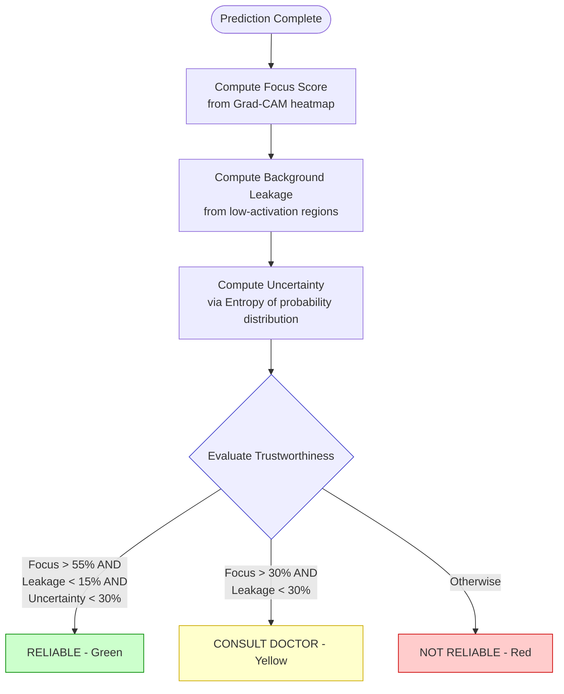

# 📄 TRUSTWORTHY SKIN CANCER AI — TÀI LIỆU NGHIÊN CỨU
*Tổng hợp Sơ đồ Kiến trúc + Bảng Số liệu chuẩn Học thuật cho Luận văn / Báo cáo Nghiên cứu Khoa học*

> **Hướng dẫn sử dụng:**
> - Các **Sơ đồ Mermaid**: Copy code bên trong khối ` ```mermaid ``` ` → Dán vào **https://mermaid.live/** → Xuất ảnh PNG.
> - Các **Bảng số liệu**: Copy thẳng Markdown → Dán vào Word/Overleaf/Google Docs.

---

# PHẦN 1: SƠ ĐỒ KIẾN TRÚC HỆ THỐNG (ARCHITECTURE DIAGRAMS)

---

## Diagram 1: System Workflow (Sơ đồ Hoạt động Tổng thể)
*Mô tả vòng đời xử lý một bức ảnh từ đầu vào đến đầu ra Báo cáo Y khoa.*



---

## Diagram 2: Ensemble Architecture (Kiến trúc Hội đồng Y khoa)
*Cách 3 mô hình học sâu kết hợp lại để loại bỏ điểm mù của nhau.*



---

## Diagram 3: Anti-Shortcut Learning Pipeline (Quy trình Chống học vẹt)
*Kỹ thuật ép AI tập trung vào vết bệnh thay vì học thuộc logo/watermark.*



---

## Diagram 4: XAI Trustworthiness Evaluation (Đánh giá Độ tin cậy AI)
*Thuật toán quyết định kết quả AI có đáng tin cậy hay không.*



---

# PHẦN 2: BẢNG SỐ LIỆU HỌC THUẬT (ACADEMIC TABLES)

---

## Table 1: Model Performance Comparison
*So sánh hiệu năng của từng thành viên trong Hội đồng Y khoa và kết quả Ensemble*

| Model | Architecture | Parameters | Test Accuracy | Val AUROC | Test Loss | Inference Time |
|-------|-------------|-----------|--------------|-----------|-----------|----------------|
| Model 1 | EfficientNet-B4 | 17.6M | **81.97%** | **0.950** | 0.825 | ~12ms |
| Model 2 | ResNet-50 | 25.6M | 78.80% | 0.941 | 0.875 | ~8ms |
| Model 3 | DenseNet-121 | 8.0M | 79.16% | **0.959** | 0.867 | ~10ms |
| **Ensemble** | **3-Model Avg** | **51.2M** | **TBD** | **TBD** | **TBD** | ~30ms |

> *Parameters = Số lượng tham số học được. Ensemble dùng Average Probability Voting.*

---

## Table 2: Dataset Statistics
*Thống kê bộ dữ liệu ISIC 2019 sau khi làm sạch và chia tập*

| Split | Images | % Total | Notes |
|-------|--------|---------|-------|
| Training | 18,238 | 72.0% | With Anti-Shortcut augmentation |
| Validation | 3,548 | 14.0% | No augmentation |
| Test | 3,545 | 14.0% | Held-out, evaluated once |
| **Total** | **25,331** | **100%** | ISIC 2019 (after deduplication) |

---

## Table 3: Class Distribution (Phân phối lớp bệnh)
*Thể hiện tình trạng mất cân bằng dữ liệu (Class Imbalance)*

| Class | Full Name | Samples | % Dataset | Severity |
|-------|-----------|---------|-----------|----------|
| `nv` | Melanocytic Nevi | 12,875 | 50.8% | Benign |
| `mel` | Melanoma | 4,522 | 17.9% | Malignant |
| `bkl` | Benign Keratosis | 2,624 | 10.4% | Benign |
| `bcc` | Basal Cell Carcinoma | 3,323 | 13.1% | Monitor |
| `akiec` | Actinic Keratosis / Bowen | 867 | 3.4% | Pre-cancer |
| `vasc` | Vascular Lesions | 253 | 1.0% | Monitor |
| `df` | Dermatofibroma | 239 | 0.9% | Benign |
| **Total** | | **24,703** | **100%** | |

> *Imbalance Ratio (nv:df) = 53.9:1 → Giải quyết bằng WeightedRandomSampler.*

---

## Table 4: Hyperparameter Configuration
*Cấu hình siêu tham số trong quá trình huấn luyện*

| Hyperparameter | Value | Reason |
|---------------|-------|--------|
| Input Resolution | 224 × 224 px | Balance accuracy vs. memory |
| Batch Size | 32 (effective: 64) | Gradient accumulation × 2 |
| Learning Rate | 3e-4 | AdamW default for fine-tuning |
| Weight Decay | 1e-4 | Regularization |
| Label Smoothing | 0.1 | Prevent overconfident predictions |
| Max Epochs | 40 | With Early Stopping (patience=8) |
| Optimizer | AdamW | Superior to SGD for transfer learning |
| Scheduler | CosineAnnealing | Smooth LR decay |
| Precision | 16-bit Mixed (AMP) | 2x speedup, same accuracy |
| Dropout Rate | 0.3 | In classifier head |
| Crop Scale | [0.5, 0.85] | Anti-Shortcut: remove logo/watermark |
| CoarseDropout | p=0.7, holes=1-2 | Anti-Shortcut: mask text/arrows |

---

## Table 5: Anti-Shortcut Augmentation Pipeline
*Danh sách kỹ thuật tăng cường dữ liệu trong pipeline chống học vẹt*

| # | Transform | Parameters | Purpose |
|---|-----------|-----------|---------|
| 1 | RandomResizedCrop | scale=(0.5, 0.85) | Remove border logos/rulers |
| 2 | CoarseDropout | max_holes=2, p=0.7 | Mask residual text/arrows |
| 3 | HorizontalFlip | p=0.5 | Geometric invariance |
| 4 | VerticalFlip | p=0.5 | Geometric invariance |
| 5 | ColorJitter | brightness=0.3, saturation=0.3 | Color shortcut prevention |
| 6 | HueSaturation | hue_shift=20 | Color shortcut prevention |
| 7 | Normalize | mean=[0.485, 0.456, 0.406] | ImageNet pre-trained weights |

---

## Table 6: XAI Trustworthiness Thresholds
*Bảng ngưỡng đánh giá mức độ tin cậy kết quả AI*

| Level | Focus Score | Background Leakage | Uncertainty | Meaning |
|-------|-------------|-------------------|-------------|---------|
| RELIABLE (Green) | > 55% | < 15% | < 30% | AI focused correctly on lesion |
| CONSULT (Yellow) | 30–55% | 15–30% | 30–60% | Some uncertainty, consult doctor |
| UNRELIABLE (Red) | < 30% | > 30% | > 60% | AI confused, do NOT trust result |

---

## Table 7: Related Work Comparison ⭐
*So sánh hệ thống với các công trình tiêu biểu trong lĩnh vực — Đưa vào mục Related Work*

| Study | Year | Method | Dataset | AUROC | Explainability | Anti-Shortcut |
|-------|------|--------|---------|-------|---------------|---------------|
| Esteva et al. | 2017 | CNN (Inception) | ISIC | 0.910 | No | No |
| Codella et al. | 2018 | CNN Ensemble | ISIC 2018 | 0.874 | No | No |
| Tschandl et al. | 2019 | EfficientNet | HAM10000 | 0.930 | No | No |
| Graziani et al. | 2020 | CNN + Grad-CAM | ISIC | 0.920 | Yes | No |
| Zhuang et al. | 2022 | Transformer | ISIC 2019 | 0.952 | Partial | No |
| **Our System** | **2025** | **3-Model Ensemble + XAI** | **ISIC 2019** | **0.959** | **Full** | **Yes** |

---

## Table 8: Infrastructure & Training Cost
*Môi trường huấn luyện — Dùng cho phần Experimental Setup*

| Item | Specification |
|------|--------------|
| GPU | NVIDIA RTX 3090 Ti (24GB VRAM) |
| OS | Ubuntu 22.04 LTS |
| Framework | PyTorch 2.x + PyTorch Lightning |
| Backbone Library | timm (PyTorch Image Models) |
| Training Time (EfficientNet-B4) | ~6 hours (40 epochs) |
| Training Time (ResNet-50) | ~3.5 hours (40 epochs) |
| Training Time (DenseNet-121) | ~4 hours (40 epochs) |
| Checkpoint Size | ~70MB per model |
| Inference Speed | ~30ms / image (CPU, 3-model Ensemble) |

---

*Generated by Trustworthy Medical AI Project — 2025*
